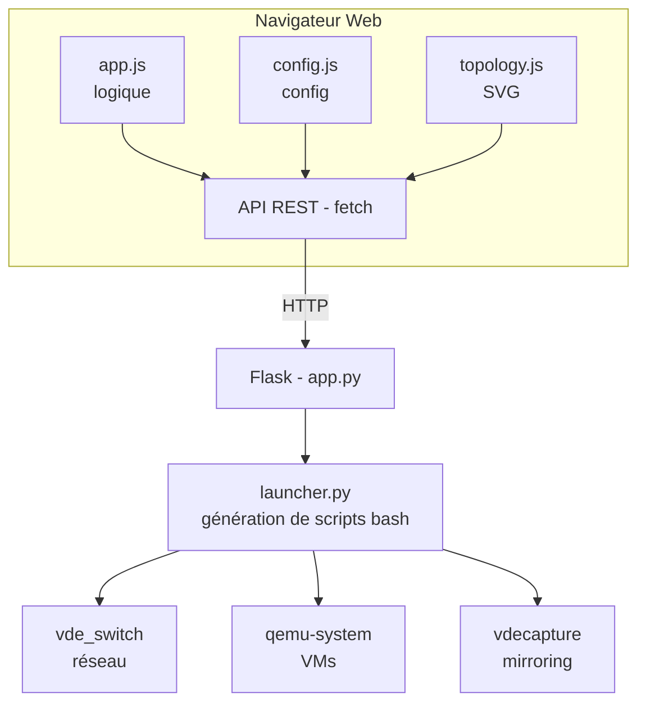

# qemu_marionum

**EFREI PARIS QEMU WIFI LAB** — Interface web pour créer et gérer des labs de machines virtuelles QEMU interconnectées via un réseau VDE, avec support WiFi virtuel (vwifi).

## Architecture de l'application

### Vue d'ensemble

L'application suit une architecture **client-serveur** classique :



### Structure des fichiers

```
qemu_marionum/
├── webgui/                      # Application web
│   ├── app.py                   # Serveur Flask — API REST + gestion des processus
│   ├── launcher.py              # Générateur de scripts bash per-VM
│   ├── requirements.txt         # Dépendance : python3-flask
│   ├── setup-service.sh         # Installeur de service systemd
│   ├── qemu-webgui.desktop      # Raccourci bureau
│   ├── templates/
│   │   └── index.html           # Page unique (SPA-like) avec layout drag-and-drop
│   └── static/
│       ├── css/style.css        # Styles de l'interface
│       └── js/
│           ├── app.js           # Logique principale : drag-and-drop, appels API, polling
│           ├── config.js        # Panel de configuration, construction de l'aperçu CLI
│           └── topology.js      # Rendu SVG de la topologie réseau (switch, VMs, NAT)
├── alpine-vwifi/                # Préparation d'image Alpine avec support vwifi
│   ├── prepare-image.sh         # Script à exécuter dans la VM Alpine
│   └── local.d/                 # Scripts de démarrage OpenRC
│       ├── setup-net.start
│       ├── setup-pkg.start
│       └── vwifi.start
```

### Backend (Flask — `app.py`)

Le serveur Flask expose une API REST et gère le cycle de vie des VMs :

| Endpoint | Méthode | Description |
|---|---|---|
| `/` | GET | Page principale |
| `/api/disks` | GET | Scan des images disque (`.qcow2`, `.img`, `.raw`) |
| `/api/browse` | GET | Navigateur de fichiers |
| `/api/launch` | POST | Lance le lab complet |
| `/api/stop` | POST | Arrête le lab (préserve l'état dans `/tmp/vde/`) |
| `/api/clean` | POST | Arrête le lab et supprime `/tmp/vde/` |
| `/api/restart` | POST | Redémarre depuis l'état préservé |
| `/api/status` | GET | État du lab (VDE actif, nombre de VMs, etc.) |
| `/api/vm/status/<id>` | GET | État d'une VM individuelle |
| `/api/vm/start` | POST | Démarre/redémarre une VM |
| `/api/vm/stop` | POST | Arrête une VM |
| `/api/vm/launch-single` | POST | Ajoute dynamiquement une VM au lab |
| `/api/mirror/start` | POST | Active le port mirroring (Wireshark via FIFO) |
| `/api/mirror/stop` | POST | Désactive le port mirroring |
| `/api/memory` | GET | RAM/swap système (cgroup v2/v1 ou `/proc/meminfo`) |
| `/api/output` | GET | Flux de sortie incrémental (polling) |

**Gestion des processus :** L'état du lab est maintenu dans un dictionnaire global `lab_state` protégé par un `threading.Lock`. Les VMs sont lancées dans des threads démons, et la sortie est capturée ligne par ligne pour le streaming vers le frontend.

### Générateur de scripts (`launcher.py`)

Au lieu d'appeler QEMU directement, `launcher.py` génère un script bash complet (`/tmp/vde/webgui-launch.sh`) qui :

1. Crée le switch VDE (`vde_switch`)
2. Prépare les disques par VM (snapshot `qemu-img create -b` ou copie)
3. Génère les seeds cloud-init ou les fichiers fw_cfg selon le backend
4. Lance chaque VM via `qemu-system-x86_64` avec un script dédié (`vmN-cmd.sh` + `vmN-xterm.sh`)
5. Sauvegarde les paramètres dans `/tmp/vde/params.json` pour permettre le redémarrage

### Frontend (JavaScript vanilla)

Le frontend est composé de trois modules sans framework :

- **`app.js`** — Point d'entrée : initialisation, drag-and-drop HTML5 pour placer les VMs sur le canvas, appels API via `fetch`, polling de la sortie en temps réel, gestion per-VM (démarrer/stopper individuellement).

- **`config.js`** — Panel de configuration latéral : gestion des options globales et per-VM (disque, RAM, CPU, mode disque, backend), construction de l'aperçu de la commande CLI en temps réel.

- **`topology.js`** — Rendu SVG interactif de la topologie réseau : VDE switch au centre, VMs en disposition circulaire, gateway NAT, serveur vwifi optionnel, lignes de connexion. Les nœuds sont déplaçables par drag.

### Backends de provisioning

Chaque VM peut utiliser l'un des 4 backends :

| Backend | OS cible | Provisioning | RAM par défaut |
|---|---|---|---|
| `fwcfg` | Alpine | Fichiers fw_cfg (QEMU `-fw_cfg`) | 512 MB |
| `cloudinit` | Debian | Seed ISO cloud-init | 1024 MB |
| `vwifi_fwcfg` | Alpine | fw_cfg + configuration vwifi | 512 MB |
| `vwifi_cloudinit` | Debian | cloud-init + configuration vwifi | 1024 MB |

### Réseau

- **VDE switch** (`vde_switch`) : switch virtuel Ethernet en espace utilisateur, socket dans `/tmp/vde/switch/`
- **NAT** (optionnel) : accès Internet via un réseau QEMU user-mode (`-nic user`)
- **Mode Hub** : tous les ports voient tout le trafic (utile pour le sniffing)
- **Port mirroring** : `vdecapture` écrit le trafic dans une FIFO lue par Wireshark

### État du lab (`/tmp/vde/`)

```
/tmp/vde/
├── switch/          # Socket VDE
├── mgmt             # Socket de management VDE
├── params.json      # Paramètres du lab (pour restart)
├── vm_pids.txt      # PIDs des processus QEMU
├── seeds/           # Seeds cloud-init par VM
├── vmN-cmd.sh       # Commande QEMU pour la VM N
├── vmN-xterm.sh     # Wrapper xterm pour la VM N
└── vde.pipe         # FIFO pour le port mirroring
```

### Préparation d'image Alpine vwifi (`alpine-vwifi/`)

Le script `prepare-image.sh` est exécuté à l'intérieur d'une VM Alpine fraîchement installée pour :
- Installer les paquets nécessaires (`iw`, `hostapd`, `wpa_supplicant`, `mac80211_hwsim`, etc.)
- Copier les scripts de démarrage OpenRC (`local.d/`) qui configurent automatiquement le réseau et le rôle vwifi (server/client) au boot via les fichiers fw_cfg

### Installation

#### Dépendances système (Ubuntu/Debian)

```bash
# Paquets obligatoires
sudo apt install python3-flask qemu-system-x86 qemu-utils vde2 xterm socat

# Pour le backend cloud-init (Debian VMs) — au moins l'un des deux :
sudo apt install cloud-image-utils    # fournit cloud-localds (recommandé)
sudo apt install genisoimage          # alternative si cloud-localds absent

# Optionnel — port mirroring / capture réseau
sudo apt install wireshark
```

| Paquet | Fournit | Rôle |
|--------|---------|------|
| `python3-flask` | Flask | Serveur web de l'application |
| `qemu-system-x86` | `qemu-system-x86_64` | Hyperviseur des VMs |
| `qemu-utils` | `qemu-img` | Création des disques overlay/copy |
| `vde2` | `vde_switch` | Switch virtuel Ethernet inter-VMs |
| `xterm` | `xterm` | Terminal d'affichage des VMs |
| `socat` | `socat` | Communication avec le socket de management VDE |
| `cloud-image-utils` | `cloud-localds` | Génération des seeds ISO cloud-init |
| `genisoimage` | `genisoimage` | Alternative pour la génération des seeds ISO |
| `wireshark` | `wireshark` | Capture réseau via port mirroring (optionnel) |

#### vdecapture (compilation manuelle)

`vdecapture` est nécessaire pour la fonctionnalité de port mirroring Wireshark. Il n'est pas disponible dans les dépôts Ubuntu et doit être compilé depuis les sources :

```bash
sudo apt install git cmake gcc libvdeplug-dev
git clone https://github.com/virtualsquare/vdecapture.git
cd vdecapture
mkdir build && cd build
cmake ..
make
sudo make install
```

#### QEMU avec support VDE (si nécessaire)

Si la version de QEMU installée ne supporte pas VDE (`-netdev vde`), il faut la recompiler :

```bash
sudo apt install build-essential ninja-build pkg-config libglib2.0-dev \
    libpixman-1-dev libvdeplug-dev libslirp-dev
wget https://download.qemu.org/qemu-<version>.tar.xz
tar xf qemu-<version>.tar.xz && cd qemu-<version>
./configure --target-list=x86_64-softmmu --enable-vde --enable-slirp
make -j$(nproc)
sudo make install
```

#### Lancement

```bash
# Installation comme service systemd (installe aussi les dépendances apt)
sudo bash webgui/setup-service.sh [utilisateur]

# Ou lancement manuel
cd webgui && python3 app.py
# → http://localhost:5000
```

#### Images disque

L'application a besoin d'images disque QEMU (`.qcow2`, `.img`, `.raw`) pour les VMs :

- **Backend `cloudinit` / `vwifi_cloudinit`** : image Debian genericcloud ([debian.org/cdimage/cloud](https://cloud.debian.org/cdimage/cloud/))
- **Backend `fwcfg` / `vwifi_fwcfg`** : image Alpine préparée manuellement (voir `alpine-vwifi/prepare-image.sh`)

#### Dépendances dans les VMs (backend vwifi uniquement)

Pour les backends `vwifi_cloudinit` et `vwifi_fwcfg`, les VMs ont besoin de :
- `vwifi-server`, `vwifi-client`, `vwifi-add-interfaces` (compilés depuis [github.com/linux-music-acoustics/vwifi](https://github.com/linux-music-acoustics/vwifi))
- Module noyau `mac80211_hwsim`
- `iw`, `hostapd`, `wpa_supplicant`, `tmux`, `tcpdump`

Pour les images Alpine, le script `alpine-vwifi/prepare-image.sh` automatise l'installation de ces dépendances.